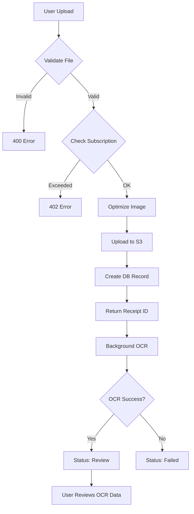

# Receipt Upload Feature - Quick Start Guide

## ���� Overview

Secure receipt image upload system with:
- AWS S3 cloud storage
- Automatic image optimization
- Background OCR processing
- Real-time status polling
- Subscription-based limits

---

## ���� Quick Start

### 1. Install Dependencies

All dependencies are already in `requirements.txt`:

```bash
pip install -r requirements.txt
```

Key packages:
- `boto3` - AWS S3 client
- `pillow` - Image processing
- `fastapi` - Web framework
- `python-multipart` - File upload support

### 2. Configure Environment

Add to `.env` file:

```env
# AWS S3 Configuration
AWS_ACCESS_KEY_ID=your_access_key_here
AWS_SECRET_ACCESS_KEY=your_secret_key_here
AWS_S3_BUCKET=tiktax-receipts
AWS_S3_REGION=eu-west-1

# File Upload Settings (already in config.py)
MAX_UPLOAD_SIZE=10485760  # 10MB
```

### 3. Create S3 Bucket

```bash
# Using AWS CLI
aws s3 mb s3://tiktax-receipts --region eu-west-1

# Enable versioning (optional but recommended)
aws s3api put-bucket-versioning \
  --bucket tiktax-receipts \
  --versioning-configuration Status=Enabled

# Enable encryption
aws s3api put-bucket-encryption \
  --bucket tiktax-receipts \
  --server-side-encryption-configuration '{
    "Rules": [{
      "ApplyServerSideEncryptionByDefault": {
        "SSEAlgorithm": "AES256"
      }
    }]
  }'
```

### 4. Run Backend

```bash
cd backend
uvicorn app.main:app --reload --port 8000
```

### 5. Test Upload

```bash
# Get auth token first
TOKEN=$(curl -X POST http://localhost:8000/api/v1/auth/login \
  -H "Content-Type: application/json" \
  -d '{"email":"test@tiktax.co.il","password":"Test123456!"}' \
  | jq -r '.access_token')

# Upload receipt
curl -X POST http://localhost:8000/api/v1/receipts/upload \
  -H "Authorization: Bearer $TOKEN" \
  -F "file=@/path/to/receipt.jpg"

# Check status
curl http://localhost:8000/api/v1/receipts/1/status \
  -H "Authorization: Bearer $TOKEN"
```

---

## ���� API Endpoints

### Upload Receipt

```http
POST /api/v1/receipts/upload
Authorization: Bearer <token>
Content-Type: multipart/form-data

file: <image_file>
```

**Response:**
```json
{
  "receipt_id": 123,
  "status": "processing",
  "message": "������ ������ ������ ������ ������"
}
```

### Check Status

```http
GET /api/v1/receipts/{receipt_id}/status
Authorization: Bearer <token>
```

**Response:**
```json
{
  "receipt_id": 123,
  "status": "review",
  "progress": 80,
  "message": "������ ������ ������",
  "ocr_data": {
    "vendor_name": "���� ����",
    "total_amount": 156.80,
    "vat_amount": 22.75
  }
}
```

---

## ���� File Requirements

| Property | Requirement |
|----------|-------------|
| **Formats** | JPEG, PNG, HEIC, HEIF |
| **Min Size** | 10 KB |
| **Max Size** | 10 MB |
| **Optimization** | Auto resize to 2000x2000 max |
| **Compression** | JPEG 85% quality |
| **EXIF** | Automatically stripped |

---

## ���� Processing Flow



---

## ������ Architecture

### Storage Service (`storage_service.py`)

```python
from app.services.storage_service import storage_service

# Upload file
url, size = await storage_service.upload_file(
    file_content=bytes_data,
    filename="receipt.jpg",
    user_id=123,
    mime_type="image/jpeg"
)

# Delete file
success = await storage_service.delete_file(url)

# Generate presigned URL
presigned = await storage_service.generate_presigned_url(url, expires_in=3600)
```

### Receipt Service (`receipt_service.py`)

```python
from app.services.receipt_service import receipt_service

# Process receipt (background task)
await receipt_service.process_receipt(receipt_id=123, db=db_session)
```

---

## ���� Testing

### Run Unit Tests

```bash
# Storage service tests
pytest tests/services/test_storage_service.py -v

# Upload endpoint tests
pytest tests/api/test_receipt_upload.py -v

# All tests with coverage
pytest tests/ --cov=app --cov-report=html
```

### Run Integration Test

```bash
# Start backend first
uvicorn app.main:app --reload

# In another terminal
python test_upload_integration.py
```

---

## ���� Subscription Limits

| Plan | Monthly Receipts |
|------|-----------------|
| Free | 50 |
| Starter | 200 |
| Pro | 1,000 |
| Business | Unlimited |

Limits are checked before upload. Returns `402 Payment Required` if exceeded.

---

## ������ Security Features

1. **Input Validation**
   - File type whitelist
   - Size limits
   - Image integrity check

2. **S3 Security**
   - Server-side encryption (AES-256)
   - HTTPS/TLS transfer
   - IAM access control

3. **Privacy**
   - EXIF data stripped
   - Unique filenames (UUIDs)
   - User folder isolation

4. **Authorization**
   - JWT bearer tokens
   - User can only access own receipts
   - Subscription limits enforced

---

## ���� Error Handling

All errors return Hebrew messages:

| Code | Error | Hebrew Message |
|------|-------|----------------|
| 400 | Invalid type | ��� ����� �� �����. ������: JPEG, PNG, HEIC |
| 400 | Too small | ����� ������ ����. ������: 10KB |
| 413 | Too large | ����� ������ ����. ������: 10MB |
| 402 | Limit exceeded | ������ ����� ������� ��������. ���� ����� ����� ���. |
| 500 | Server error | ������ ������ �����. ��� ����. |

---

## ���� S3 Storage Structure

```
tiktax-receipts/
└── receipts/
    ├── 1/                           # User ID
    │   ├── 2024/
    │   │   ├── 11/
    │   │   │   ├── uuid1.jpg
    │   │   │   └── uuid2.jpg
    │   │   └── 12/
    │   └── 2025/
    ├── 2/
    └── 3/
```

**Format:** `receipts/{user_id}/{year}/{month}/{uuid}.jpg`

---

## ���� Monitoring

### Key Metrics

Track in production:
- Upload success rate
- Average processing time
- S3 storage per user
- Subscription limit hits
- Error frequency

### Logs

All operations logged:
```
2024-11-04 10:15:23 - INFO - Receipt uploaded: 123 by user 45
2024-11-04 10:15:30 - INFO - File uploaded: receipts/45/2024/11/uuid.jpg (52480 bytes)
2024-11-04 10:15:35 - INFO - OCR completed for receipt 123
```

---

## ���� Troubleshooting

### Issue: Upload fails with 500 error

**Check:**
1. AWS credentials in `.env`
2. S3 bucket exists and is accessible
3. IAM user has `s3:PutObject` permission
4. Backend logs for detailed error

### Issue: Image optimization fails

**Check:**
1. Pillow installed correctly
2. Image file is valid
3. Backend logs for warnings

### Issue: OCR never completes

**Check:**
1. Background tasks are running
2. Google Vision API credentials
3. Database record status

### Issue: 402 Payment Required

**Expected:** User exceeded monthly limit
**Solution:** Upgrade subscription or wait for monthly reset

---

## ������ Next Steps

After upload feature works:

1. **Implement Full OCR**
   - Integrate Google Vision API
   - Parse Hebrew text
   - Extract receipt fields

2. **Add Receipt Management**
   - List receipts endpoint
   - Get single receipt endpoint
   - Update receipt endpoint
   - Delete receipt endpoint

3. **Enhance Features**
   - Duplicate detection
   - Auto-categorization
   - Batch upload
   - Email forwarding

---

## ���� Documentation

- **API Docs:** `/backend/RECEIPT_UPLOAD_API.md`
- **Implementation:** `/backend/IMPLEMENTATION_RECEIPT_UPLOAD.md`
- **OpenAPI:** http://localhost:8000/api/v1/docs (when running)

---

## ������️ Support

For issues:
1. Check logs: `tail -f backend/logs/app.log`
2. Run tests: `pytest tests/ -v`
3. Review docs: Read RECEIPT_UPLOAD_API.md
4. Debug: Add `logger.info()` statements

---

## ���� Summary

**Implemented:**
- ��� Storage service with S3
- ��� Image optimization
- ��� Upload endpoint
- ��� Status polling endpoint
- ��� File validation
- ��� Subscription limits
- ��� Unit tests
- ��� Integration tests
- ��� API documentation

**Ready for production!** ����
